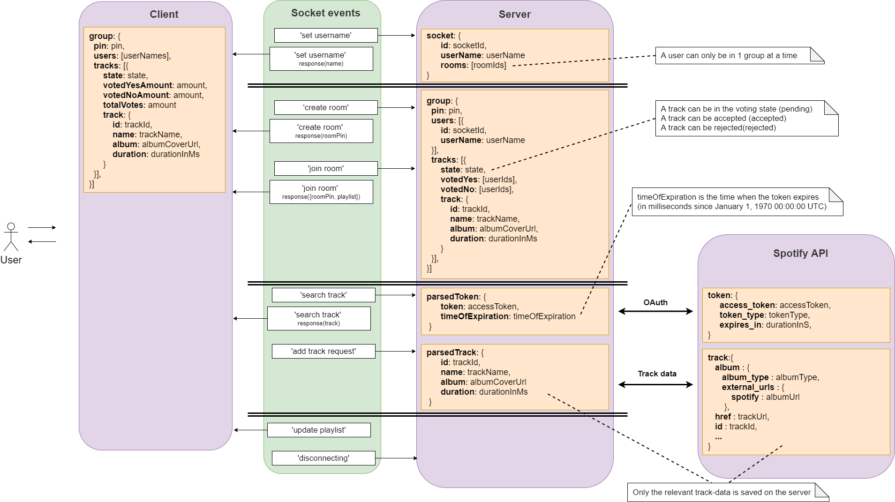

# Spotify Collaborative Playlist Maker

In week 1 of this school project I made as seperate project (safe space chat). [Click here](https://github.com/meessour/safe-space-chat) to view this repo/project.

With this collaborative playlist maker you can work together with friends to create a playlist together. Once someone makes a request to add a certain track to the playlist, a vote for that song is made. People are able to accept or decline the addition of the track in the playlist. If the majority said yes, then the song is added. This app makes use of Spotify's services like their API.

## Demo's

[Live Demo](https://collaborative-playlist-maker.herokuapp.com/)

## Table of Contents
1. [How to install](#How-to-install)
2. [Data lifecycle](#Data-lifecycle)
3. [Dataflow](#Dataflow)
4. [How does it work](#How-does-it-work)
5. [Wishlist](#Wishlist)
6. [License](#License)

## How to install
**Step 1:** Clone project:
```git
git clone https://github.com/meessour/real-time-web-1920.git
```

**Step 2:** CD to path of the project's root:
```git
cd C:/../..
```

**Step 3:** Install packages:
```git
npm install
```

**Step 4:** Start the server:
```git
npm start
```

**Step 5:** Navigate to the localhost in browser

## Data lifecycle


## Dataflow


## How does it work?
A user creates a room or joins a room. Once the room is created a pin is make in order for other's to join. When people choose to join a group, then they are required to enter this pin. Once in a room, a user can search by song titles in the search bar and choose from the result list.

## Wishlist
* Being able to save playlist on Spotify

## License
This repository is licensed as [MIT](LICENSE) @ [Mees Sour](https://github.com/meessour).
